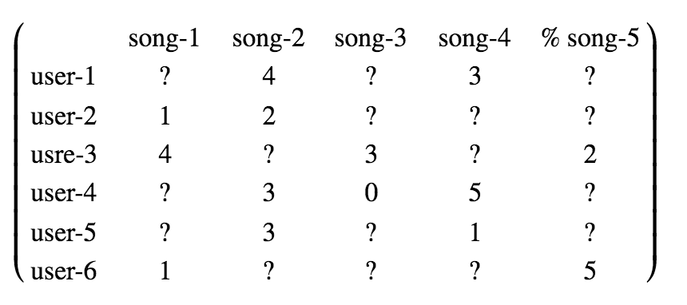
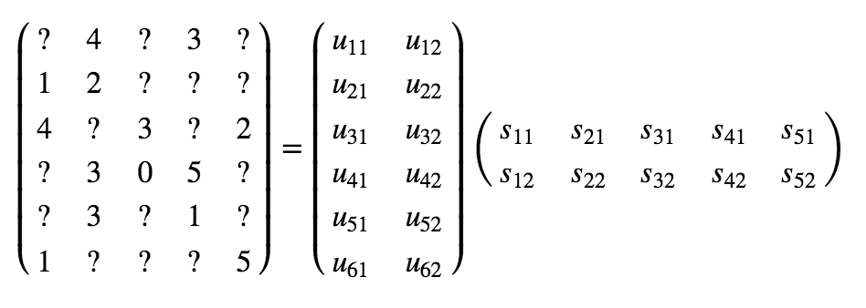
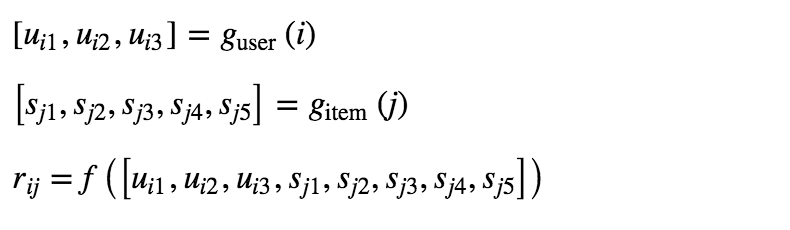
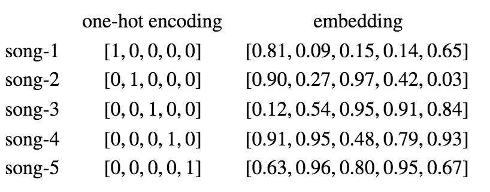
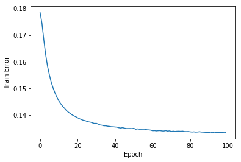
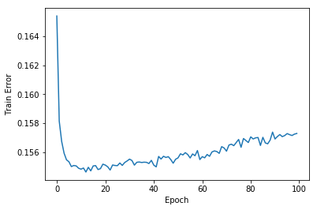
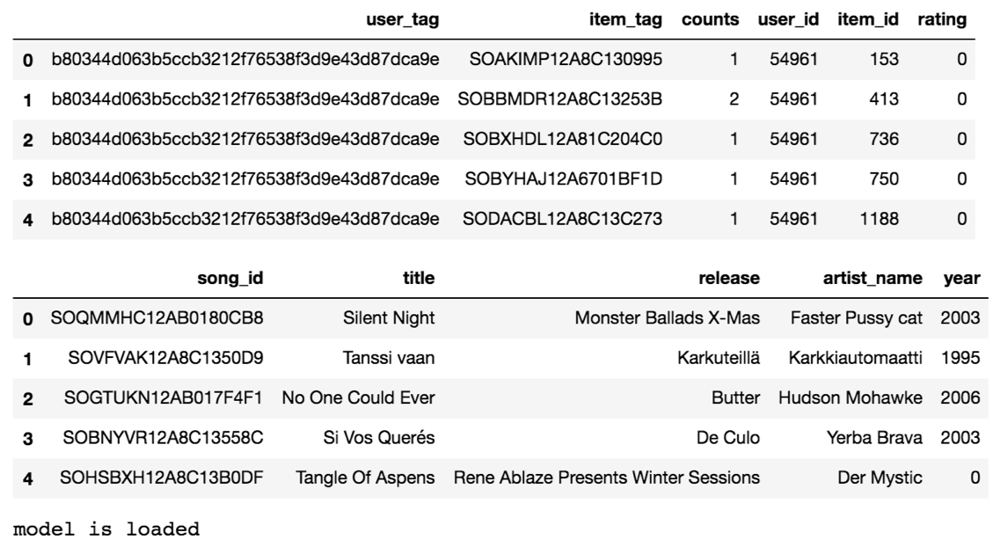
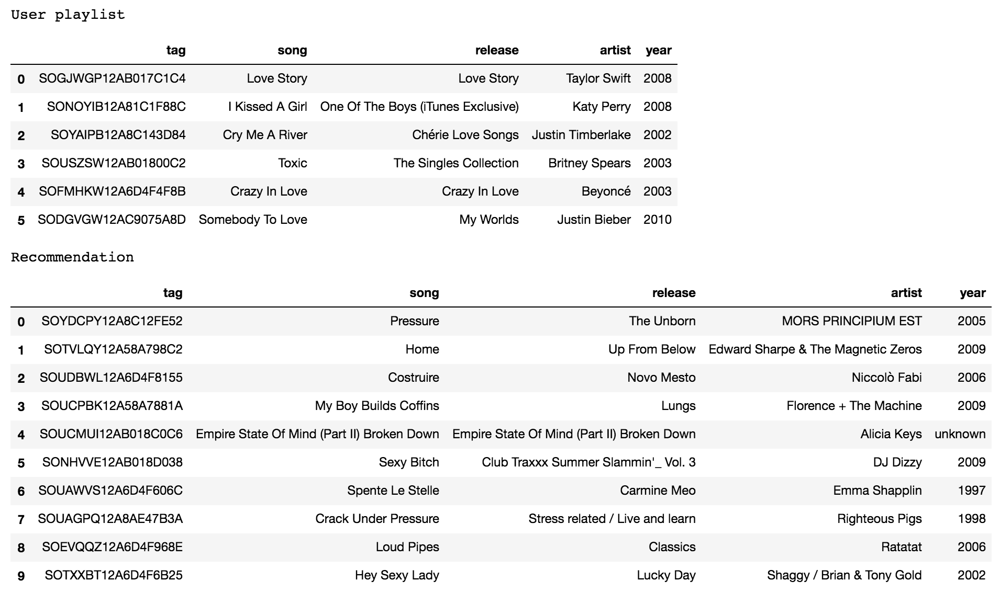
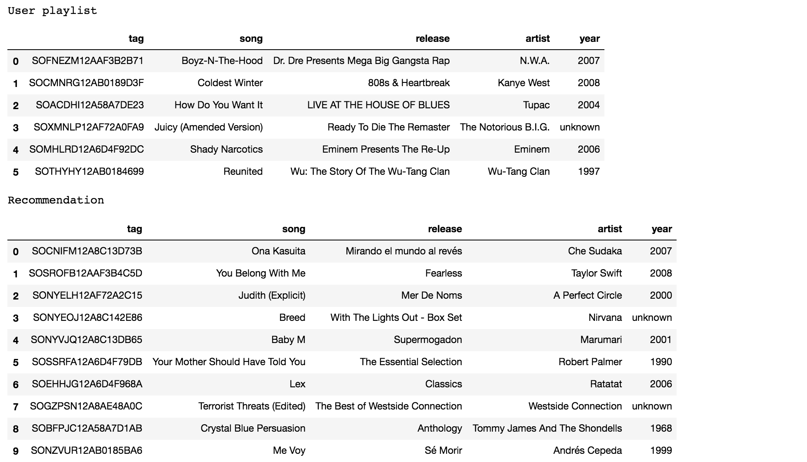
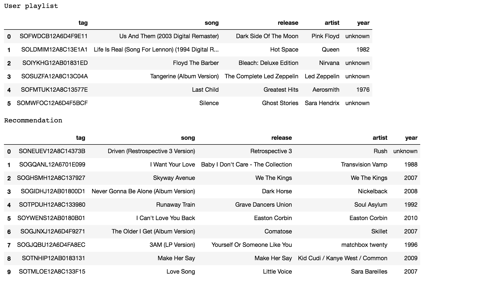

<a href="https://aspiride.github.io/Spotify-Group-21/"></a>
---
# Collaborative-Filtering Approach

## Theoretical Background

**Motivation**

In this project, we have implemented two complementary music recommendation systems, content-based approach and 
collaborative filter approach. If a playlist contains sufficiently large number of songs, one can analyze the 
features of these songs to create a machine learning model to make recommendation for the user of the playlist. 
On the other hand, if a playlist is too small, containing for example less than ten songs, it would be difficult 
to model the user's music preference based on the limited information from the playlist. To tackle this issue, we 
have implemented an alternative music recommendation system using collaborative filters. In contrast to content-based 
algorithms which focus on individual users, collaborative filters make use of the correlation (collaboration) between 
different users, assuming that two users sharing interests in some songs would probably have similar taste and preference 
for other songs. 

**Challenge**

To begin with, let us consider a user-item matrix whose rows represent users, columns represent songs, and matrix 
elements are user's ratings for songs ranging from 0 to 5. For example, the following matrix is a record of six 
users' rating to five songs: 




Notice that many matrix entries in the user-item matrix are missing because a user may only listen and rate a small 
portion of songs in the whole song set. In reality, the problem can be even more serious, an average user may have 
rated a few hundred songs out of millions, making the user-item matrix highly sparse. Therefore, the challenge is to 
make prediction of the unknown elements based on the known elements. 

**Factorization**

One popular approach of collaborative filter is called matrix factorization. The key idea is to assume that user-item 
matrix can be decomposed into the product of the user matrix and the item matrix.



in which each user is represented a vector in the user matrix and each song is represented by a vector in the item 
matrix. The user matrix and the item matrix share the same inner dimension (2 in this example) which is called latent 
space. The factorization is to tune the elements in both user matrix and item matrix so that their product best fits 
the known elements in the user-item matrix.

**Neural Network**

An alternative approach to implement collaborative filter is to use neutral network. In this approach, it is assumed that 
there is a nonlinear mapping from the user vector and the item vector to the rating, which does not have to be dot product. 
Instead, the mapping will be learned dynamically by training a neural network with known ratings.



Without the constraint of matrix product, the dimension of user latent space can be different from that of item latent 
space, providing an extra flexibility in the model.

**Embedding**

In both factorization and neural network approaches, one needs to map each individual user or song into a vector, and 
the mapping technique is known as embedding. 
Recall that one way to handle categorical variables such as user and song is one hot encoding in which each category 
is represented by a vector with many zeros and a one. The representation of one hot encoding is inefficient because 
only the position of one carries the information while the zeros are just placeholders. The embedding, in contrast, 
adopts a single 
vector to represent all categories, and the components of the vector can vary continuously. 



The mapping between categories and embedding vectors are not predefined. On the contrary, it is learned through training 
in order to best represent the relationship between categories. The size of embedding vector is a hyperparameters,
empirically determined by one fourth to the number of categories.

## Matrix Factorization

``` python
data = pd.read_csv(fullname('data/data_preprocessed.csv'))
```

```python
data_train, data_test = train_test_split(data, test_size=0.2, random_state=1126)
```

``` python
n_latent = 3
n_item = len(data.item_id.unique())
n_user = len(data.user_id.unique())
```
### Define Model

``` python
## define model
def model_factorization(n_item, n_user, n_latent):
    '''algorithm: http://nicolas-hug.com/blog/matrix_facto_1
       algorithm: http://nicolas-hug.com/blog/matrix_facto_2
       algorithm: http://nicolas-hug.com/blog/matrix_facto_3
       algorithm: http://nicolas-hug.com/blog/matrix_facto_4'''
    input_item = Input(shape=[1], name='item')
    embed_item = Embedding(n_item, n_latent, name='embedding-item')(input_item)
    vector_item = Flatten(name='vector-item')(embed_item)
    input_user = Input(shape=[1], name='user')
    embed_user = Embedding(n_user, n_latent, name='embedding-user')(input_user)
    vector_user = Flatten(name='vector-user')(embed_user)
    output = dot([vector_item, vector_user], axes=1, name='output')
    model = Model(inputs=[input_item, input_user], outputs=output)        
    return model
```

``` python
## create model
model = model_factorization(n_item, n_user, n_latent)
model.compile('adam', 'mean_squared_error')
model.summary()
```
```
__________________________________________________________________________________________________
Layer (type)                    Output Shape         Param #     Connected to                     
==================================================================================================
item (InputLayer)               (None, 1)            0                                            
__________________________________________________________________________________________________
user (InputLayer)               (None, 1)            0                                            
__________________________________________________________________________________________________
embedding-item (Embedding)      (None, 1, 3)         30000       item[0][0]                       
__________________________________________________________________________________________________
embedding-user (Embedding)      (None, 1, 3)         229059      user[0][0]                       
__________________________________________________________________________________________________
vector-item (Flatten)           (None, 3)            0           embedding-item[0][0]             
__________________________________________________________________________________________________
vector-user (Flatten)           (None, 3)            0           embedding-user[0][0]             
__________________________________________________________________________________________________
output (Dot)                    (None, 1)            0           vector-item[0][0]                
                                                                 vector-user[0][0]                
==================================================================================================
Total params: 259,059
Trainable params: 259,059
Non-trainable params: 0
```
### Train Model

``` python
N_epoch = 100
history = model.fit([data_train.item_id, data_train.user_id], data_train.rating, epochs=N_epoch, verbose=True)
```
``` python
fig,ax = plt.subplots(figsize=(6,4))
ax.plot(history.history['loss'])
#ax.set_yscale('log')
ax.set_xlabel("Epoch")
ax.set_ylabel("Train Error")
fig.savefig(fullname('train_history_mat.png'))
```


### Test Model
``` python
y_hat = np.round(model.predict([data_test.item_id, data_test.user_id]), decimals=0)
y_true = data_test.rating
err = mean_absolute_error(y_true, y_hat)
print('Mean absolute error: {0:6.4f}'.format(err))
```

## Neural Network

``` python
## load modified data
data = pd.read_csv(fullname('data/data_preprocessed.csv'))
display(data.head())
```

``` python
## train-test split
data_train, data_test = train_test_split(data, test_size=0.2, random_state=1126)
```

``` python
n_latent_user = 5
n_latent_item = 3
dropout_rate = 0.2
n_node_list = [100, 10]
n_item = len(data.item_id.unique())
n_user = len(data.user_id.unique())
```

### Define Model

``` python
## define model
def model_neuralnet(n_item, n_user, n_latent_item, n_latent_user, n_node_list, dropout_rate):
    input_item = Input(shape=[1], name='item')
    embed_item = Embedding(n_item, n_latent_item, name='embedding-item')(input_item)
    vector_item = Dropout(dropout_rate, name='dropout-item')(Flatten(name='vector-item')(embed_item))
    input_user = Input(shape=[1], name='user')
    embed_user = Embedding(n_user, n_latent_user, name='embedding-user')(input_user)
    vector_user = Dropout(dropout_rate, name='dropout-usre')(Flatten(name='vector-user')(embed_user))
    dense0 = Dropout(dropout_rate, name='dropout0')(concatenate([vector_item, vector_user], name='item-user'))
    dense1 = Dropout(dropout_rate, name='dropout1')(Dense(n_node_list[0], activation='relu', name='hidden-1')(dense0))
    dense2 = Dropout(dropout_rate, name='dropout2')(Dense(n_node_list[1], activation='relu', name='hidden-2')(dense1))
    output = Dense(1, name='output')(dense2)
    model = Model(inputs=[input_item, input_user], outputs=output)
    return model
```

``` python
## create model
model = model_neuralnet(n_item, n_user, n_latent_item, n_latent_user, n_node_list, dropout_rate)
model.compile('adam', 'mean_squared_error')
model.summary()
```

```
__________________________________________________________________________________________________
Layer (type)                    Output Shape         Param #     Connected to                     
==================================================================================================
item (InputLayer)               (None, 1)            0                                            
__________________________________________________________________________________________________
user (InputLayer)               (None, 1)            0                                            
__________________________________________________________________________________________________
embedding-item (Embedding)      (None, 1, 3)         30000       item[0][0]                       
__________________________________________________________________________________________________
embedding-user (Embedding)      (None, 1, 5)         381765      user[0][0]                       
__________________________________________________________________________________________________
vector-item (Flatten)           (None, 3)            0           embedding-item[0][0]             
__________________________________________________________________________________________________
vector-user (Flatten)           (None, 5)            0           embedding-user[0][0]             
__________________________________________________________________________________________________
dropout-item (Dropout)          (None, 3)            0           vector-item[0][0]                
__________________________________________________________________________________________________
dropout-usre (Dropout)          (None, 5)            0           vector-user[0][0]                
__________________________________________________________________________________________________
item-user (Concatenate)         (None, 8)            0           dropout-item[0][0]               
                                                                 dropout-usre[0][0]               
__________________________________________________________________________________________________
dropout0 (Dropout)              (None, 8)            0           item-user[0][0]                  
__________________________________________________________________________________________________
hidden-1 (Dense)                (None, 100)          900         dropout0[0][0]                   
__________________________________________________________________________________________________
dropout1 (Dropout)              (None, 100)          0           hidden-1[0][0]                   
__________________________________________________________________________________________________
hidden-2 (Dense)                (None, 10)           1010        dropout1[0][0]                   
__________________________________________________________________________________________________
dropout2 (Dropout)              (None, 10)           0           hidden-2[0][0]                   
__________________________________________________________________________________________________
output (Dense)                  (None, 1)            11          dropout2[0][0]                   
==================================================================================================
Total params: 413,686
Trainable params: 413,686
Non-trainable params: 0
__________________________________________________________________________________________________
```
### Train Model
```python
N_epoch = 100
history = model.fit([data_train.item_id, data_train.user_id], data_train.rating, epochs=N_epoch, verbose=True)
```

``` python
fig,ax = plt.subplots(figsize=(6,4))
ax.plot(history.history['loss'])
#ax.set_yscale('log')
ax.set_xlabel("Epoch")
ax.set_ylabel("Train Error")
fig.savefig(fullname('train_history_net.png'))
```


### Test Model
``` python
y_hat = np.round(model.predict([data_test.item_id, data_test.user_id]), decimals=0)
y_true = data_test.rating
err = mean_absolute_error(y_true, y_hat)
print('Mean absolute error: {0:6.4f}'.format(err))
```

## Recommendation

Once the user-item matrix is available, we are ready to make music recommendation. If a user happens to be in the 
user list, we can select the songs with the highest rating in row of user-item matrix corresponding to that user. 
In this project, however, the goal is to make recommendation based on a given playlist. Therefore, we need to pick 
up several users in the user-item matrix as referees who share similar music preference with the user of the given 
playlist. To be specific, we will calculate user's ratings for the playlist and find out those users who like most 
of the songs in the list. These users will serve as referees and vote on new songs. 

``` python
## load data
data = pd.read_csv(fullname('data/data_preprocessed.csv'))
display(data.head())

song_data = pd.read_csv(fullname('data/song_data.csv'))
display(song_data.head())

model = load_model(fullname(fullname('model_factorization.h5')))
print('model is loaded')
```


### Recommendation System
#### Helper Functions
``` python
def item_tag_to_id(tag_list):
    id_list = np.zeros(tag_list.shape)
    for i,tag in enumerate(tag_list):
        flag = (data.item_tag == tag)
        if np.sum(flag) > 0:
            id = data.item_id[flag].values[0]
        else:
            id = -1    
        id_list[i] = id
    return id_list

def item_id_to_tag(id_list):
    tag_list = ['']*len(id_list)
    for i,id in enumerate(id_list):
        flag = (data.item_id == id)
        if np.sum(flag) > 0:
            tag = data.item_tag[flag].values[0]
        else:
            tag = ''    
        tag_list[i] = tag
    return tag_list

def trim_rating(rating_list):
    rating_list = np.round(rating_list, decimals=0)
    rating_list = np.maximum(rating_list, 0)
    rating_list = np.minimum(rating_list, 5)
    return rating_list

def calc_rating(model, item_id_list, user_id_list):
    item_id_subspace, user_id_subspace = np.meshgrid(item_id_list, user_id_list)
    item_id_subspace = item_id_subspace.reshape(-1,1)
    user_id_subspace = user_id_subspace.reshape(-1,1)
    rating_subspace = model.predict([item_id_subspace, user_id_subspace])
    rating_subspace = rating_subspace.reshape(len(user_id_list),-1)
    rating_subspace = trim_rating(rating_subspace)
    return rating_subspace
    
def tag_list_to_table(tag_list):
    title_list = ['unknown'] * len(tag_list)
    release_list = ['unknown'] * len(tag_list)
    artist_name_list = ['unknown'] * len(tag_list)
    year_list = ['unknown'] * len(tag_list)
    for i,tag in enumerate(tag_list):
        ind = (song_data.song_id == tag)
        if np.sum(ind) > 0:
            title_list[i] = song_data[ind].title.values[0]
            release_list[i] = song_data[ind].release.values[0]
            artist_name_list[i] = song_data[ind].artist_name.values[0]
            year = song_data[ind].year.values[0]
            if year > 0:
                year_list[i] = year 
    tag_table = pd.DataFrame({'tag':tag_list, 'song':title_list, 'release':release_list,
                            'artist':artist_name_list, 'year':year_list})
    return tag_table

def make_recommendation(playlist, N_song_recommend=10, N_referee=10):
    id_table = tag_list_to_table(playlist)
    play_id_list = item_tag_to_id(playlist)
    play_id_list = play_id_list[play_id_list>=0]   
    if len(play_id_list) == 0:
        id_table_rec = []
        return id_table_rec, id_table          
    
    rating_max = 5
    n_user = len(data.user_id.unique())    
    rating_subspace = calc_rating(model, play_id_list, np.arange(n_user))
    
    MatchingFactor = (rating_subspace / rating_max) @ np.ones(len(play_id_list)) / len(play_id_list)
    referee_index = np.argsort(MatchingFactor)[::-1][0:N_referee]
    referee_prob = MatchingFactor[referee_index]
    referee_prob = referee_prob / np.sum(referee_prob)

    n_item = len(data.item_id.unique())
    rating_subspace2 = calc_rating(model, np.arange(n_item), referee_index)
    rating_list2 = referee_prob @ rating_subspace2

    item_id_list_recommend = np.arange(n_item)
    rating_list2[np.in1d(item_id_list_recommend, play_id_list)] = -1
    item_id_list_recommend = item_id_list_recommend[np.argsort(rating_list2)][::-1]
    item_id_list_recommend = item_id_list_recommend[0:N_song_recommend]

    item_tag_list_recommend = item_id_to_tag(item_id_list_recommend)
    id_table_rec = tag_list_to_table(item_tag_list_recommend)
    
    return id_table_rec, id_table    
```

## Discussion
The factorization and neural network have similar test accuracy for making the user-item matrix prediction. The 
factorization approach only has one hyperparameter (the dimension of the latent space) and the training is faster 
than neural network. Neural network, on the hand, has more hyperparameters associated with the network architecture 
as well as the latent spaces, which enables higher model capability but also imposes challenges concerning parameter 
tuning. For neural network, we have tried different architectures and latent spaces, all of which have similar performance.

A subset of The Echo Nest Taste Profile containing 10,000 songs is used to training models in this project. If we 
had more computing resources, we would have trained our models using the complete dataset which has 49 million songs. 
In addition to PC, we have tested CPU, GPU, and TPU on COLAB. Unfortunately, no significant acceleration is observed by 
using GPU or TPU, which might be attributed to the large matrix size resulting in bottleneck for transferring data to 
and from GPU or TPU.

## Playlist Tests
### Playlist 1: Pop
``` python
playlist = np.array(['SOGJWGP12AB017C1C4', 'SONOYIB12A81C1F88C', 'SOYAIPB12A8C143D84', 
                     'SOUSZSW12AB01800C2', 'SOFMHKW12A6D4F4F8B', 'SODGVGW12AC9075A8D'])

id_table_rec, id_table = make_recommendation(playlist)
print('User playlist')
display(id_table)
print('Recommendation')
display(id_table_rec)
```


Not a lot of the recommended songs fall into the pop genre. Alicia Keys is probably the closest artist to pop in the 
resulting output.

``` python
playlist = np.array(['SOFNEZM12AAF3B2B71', 'SOCMNRG12AB0189D3F', 'SOACDHI12A58A7DE23', 
                     'SOXMNLP12AF72A0FA9', 'SOMHLRD12A6D4F92DC', 'SOTHYHY12AB0184699'])

id_table_rec, id_table = make_recommendation(playlist)
print('User playlist')
display(id_table)
print('Recommendation')
display(id_table_rec)
```


Similarly to the pop test, the recommendation engine is not predicting rap songs for the test playlist.

``` python
playlist = np.array(['SOFWDCB12A6D4F9E11', 'SOLDMIM12A8C13E1A1', 'SOIYKHG12AB01831ED', 
                     'SOSUZFA12A8C13C04A', 'SOFMTUK12A8C13577E', 'SOMWFOC12A6D4F5BCF'])

id_table_rec, id_table = make_recommendation(playlist)
print('User playlist')
display(id_table)
print('Recommendation')
display(id_table_rec)
```



