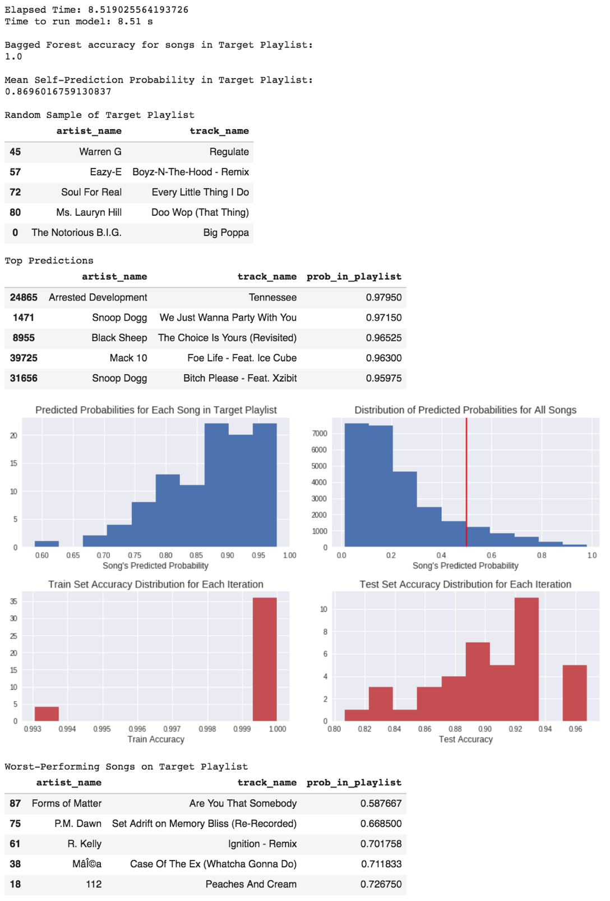
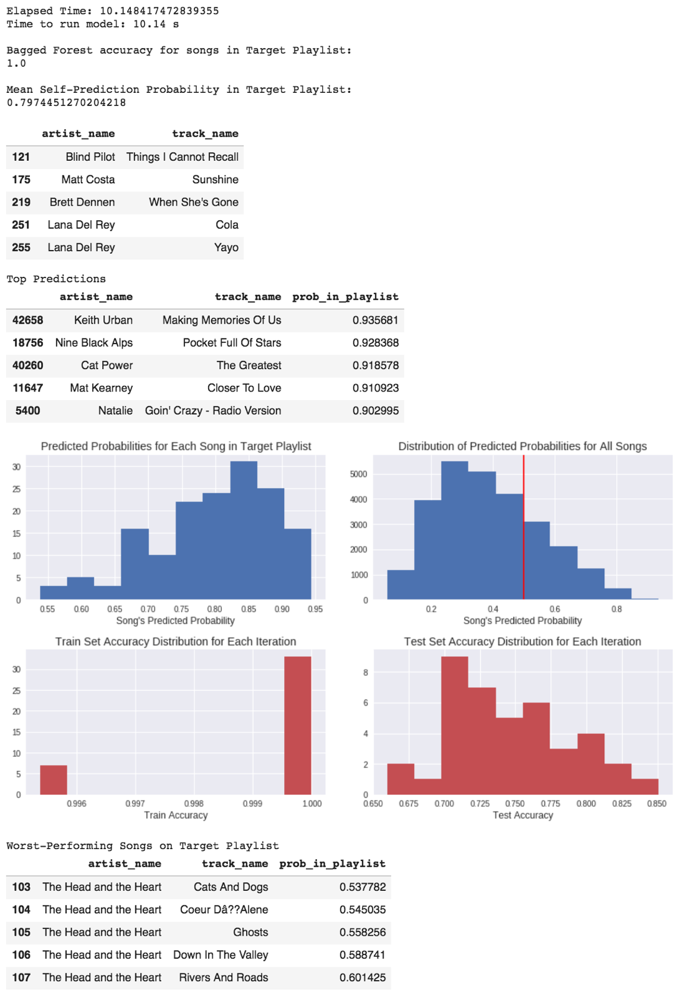
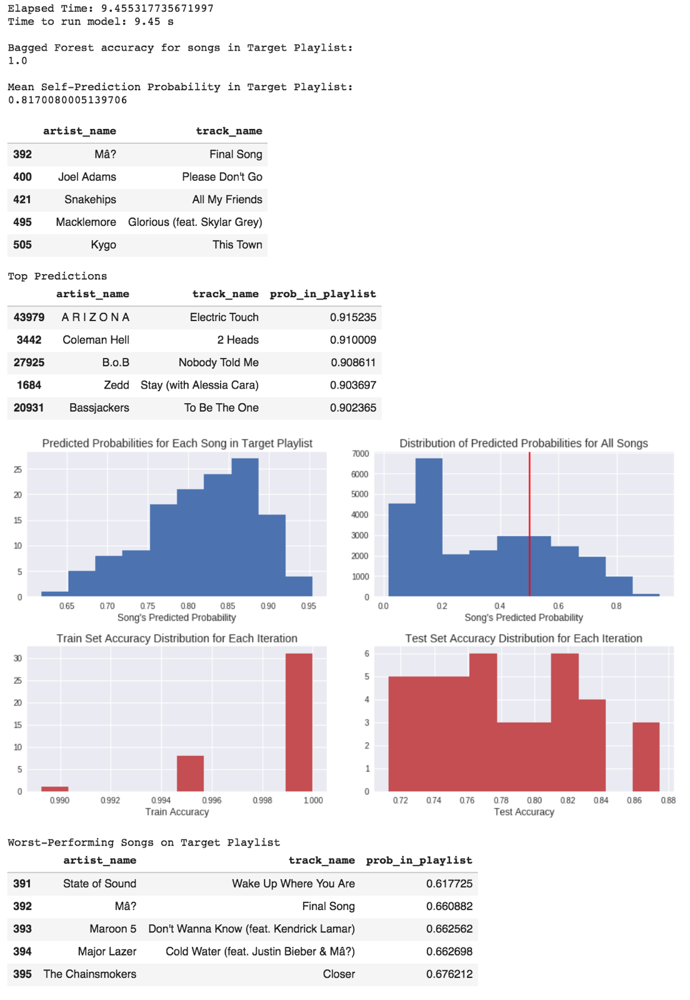
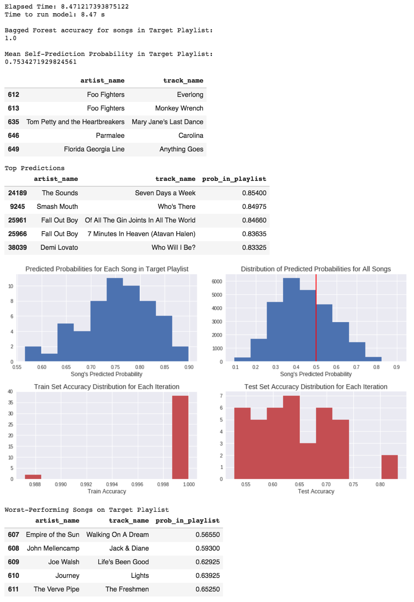
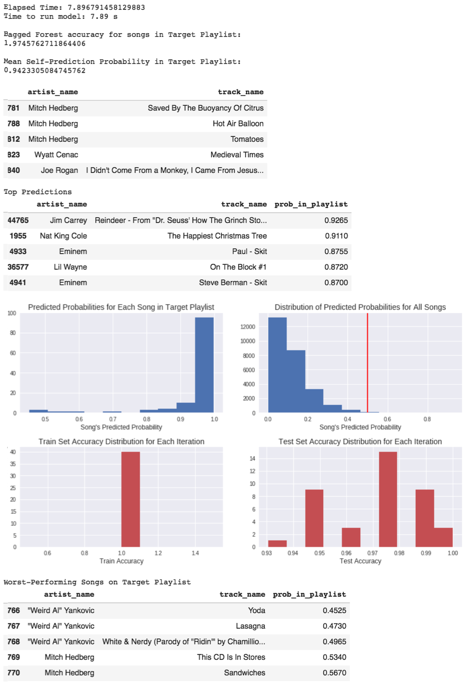
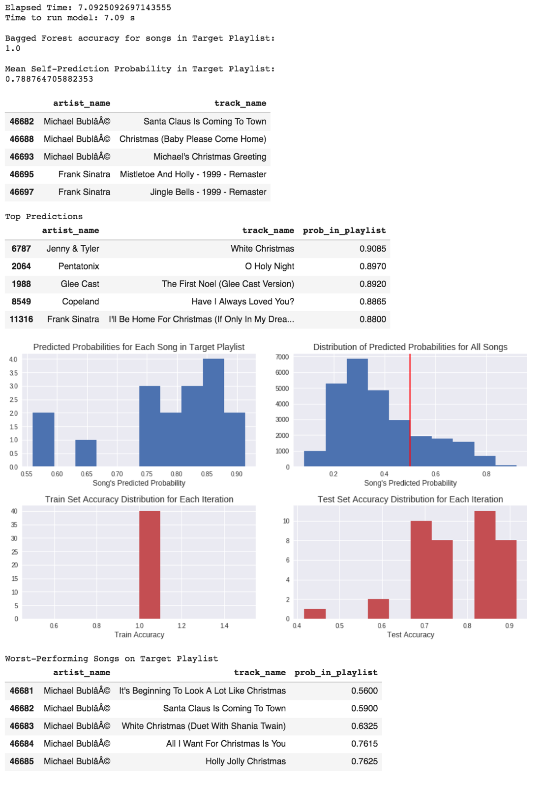

## Contents
* [Model Evaluation and Conclusions](https://aspiride.github.io/Spotify-Group-21/Conclusions#model-evaluation-and-conclusions)
* [Results and Discussion](https://aspiride.github.io/Spotify-Group-21/Conclusions#results-and-discussion)
  - [Rap Music](https://aspiride.github.io/Spotify-Group-21/Conclusions#rap-music)
  - [Chill/Indie Music](https://aspiride.github.io/Spotify-Group-21/Conclusions#rap-music)

---
# Conclusion and Discussions

## Model Evaluation and Conclusions
Both the content-based and collaborative filtering models had fairly high training and test scores with their respective datasets. Specifically regarding the collaborative filtering model, it was chosen because it applies well to the cold start problem. It is difficult for a model to determine songs that the user would like when there are few songs already in the playlist - few training data. The collaborative filtering approach was chosen because it would be able to select from similar users who incorporated the same song in their playlists to determine what possible songs could be added to the target playlist. Due to this, there is a sort of "popularity contest" that occurs with this method.

In terms of which model performed better, the predictions in the collaborative filtering model were not as similar to those made by the content-based model. In fact, the content-based model was able to produce very accurate predictions, which was surprising given that it only used about 60k songs. 

The bagged forest approach seemed to improve the predictions in a non-quantifiable measure, more that it allowed for more consistent predictions and did not overfit to any one training set's rejected songs. Using Principal Component Analysis did not have a measurable improvement on duration or model accuracy, making it unnecessary in this application. However, if more features were added that possibly had more multicollinearity, then it might be used. Adding the k-means clusters may have improved the predictions, but more work would need to be done in order to establish the optimal number of clusters. Alternatively, some other clustering algorithm could be used (such as [hierarchical clustering](https://en.wikipedia.org/wiki/Hierarchical_clustering)).

For the reader's convenience, we generated some predictions for a subset of the playlists in the dataset and aggregated the links to the songs in the tables below.

## Results and Discussion
### Rap Music

The content-based model performed really well on rap music. This is probably because rap music is fairly distinct as a genre: high speechiness yet fairly high danceability as well.

|  **Playlist 49000** |   |   |   |   |   |  
|---|---|---|---|---|---|
| **Random Sample of Target Playlist**  |   |   |   |   |   |
| **Top Predictions**  |   |   |   |   |   |
| **Worst Performing Songs on Playlist**  |   |   |   |   |   |

This playlist features mainly rap and R&B music, and the corresponding top predictions are mostly related to rap. The worst-performing songs on the target playlist tend to be songs that aren't explicitly rap, but are more influenced by R&B tunes. Thus, the model is learning the pattern of features that associates to late 1990s to early 2000s rap that is present in the playlist.

### Chill/Indie Music

The content-based model performed fairly well on chill/indie music as well. However, this playlist was more diverse in song genre than the previous playlist. Thus, it's harder to judge how well the recommended songs would fit into the playlist.

|  **Playlist 49001** |   |   |   |   |   |  
|---|---|---|---|---|---|
| **Random Sample of Target Playlist**  |   |   |   |   |   |
| **Top Predictions**  |   |   |   |   |   |
| **Worst Performing Songs on Playlist**  |   |   |   |   |   |

The model has a slight preference for country music in this playlist, indicated by Keith Urban at the top of the prediction list. This was a difficult training set: all of the songs were from entire albums of just a few singers. Since we are not using artist as a feature, it was more difficult for the model to determine common threads. This is indicated by the large proportion of songs that are above the 0.5 level in the top right histogram. However, the overall shape of the histogram is preserved and is what we would expect: right-skewed since the majority of the songs should be classified as not being in the playlist.

### Pop Music

The content-based model performed better on pop music. This playlist also appears to be more diverse, but primarily has bass undertones and typcally female vocals, similar to house music. 

|  **Playlist 49004** |   |   |   |   |   |  
|---|---|---|---|---|---|
| **Random Sample of Target Playlist**  |   |   |   |   |   |
| **Top Predictions**  |   |   |   |   |   |
| **Worst Performing Songs on Playlist**  |   |   |   |   |   |

This playlist is also diverse, much like 49001 above. This is indicated by the wide spread of the target playlist probabilities - the model is having a harder time being confident about its predictions. This is also evidenced by what the above output shows is in the model: Macklemore is pop-rap while Maroon V is more pure pop and Major Lazer is house music.

### Rock Music

|  **Playlist 49006** |   |   |   |   |   |  
|---|---|---|---|---|---|
| **Random Sample of Target Playlist**  |   |   |   |   |   |
| **Top Predictions**  |   |   |   |   |   |
| **Worst Performing Songs on Playlist**  |   |   |   |   |   |

This training set produced the lowest self-predicted probabilities out of everything seen so far (<0.9). Looking at the distribution of predicted probabilities for all of the songs, the model is classifying a lot of songs above 0.5, which suggests that the training playlist is also diverse. Despite that, the model is able to still give rock recommendations that are fairly similar to the songs in the playlist.

### Stand Up Comedy

This model was trained on a playlist of stand up comedy on Spotify. This should have been more difficult for the model because the slice of data we used contained less stand up comedy, which is high in speechiness and low in danceability. 

|  **Playlist 49009** |   |   |   |   |   |  
|---|---|---|---|---|---|
| **Random Sample of Target Playlist**  |   |   |   |   |   |
| **Top Predictions**  |   |   |   |   |   |
| **Worst Performing Songs on Playlist**  |   |   |   |   |   |

This was very difficult for the model. Listening to the predicted songs, they are clearly high on speechiness, which is presumably why they were chosen. However, there probably were not any other playlists of stand up in this dataset, so the model likely was unable to come up with good candidates that were actually stand up comedy. The worst self-predictions occurred on Weird Al Yankovic songs, which are obviously songs and not stand up comedy. Interestingly though, the top prediction is by Jim Carrey, who is a comedian. But, whoever created this playlist probably would not at Nat King Cole's "The Happiest Christmas Tree" in it. Adding a feature that classifies things into songs or stand up or podcasts would probably improve this prediction, as would predicting on a larger dataset.

### Christmas Songs

Finally, we decided to look at Christmas songs, since 'tis the season!

|  **Playlist 49696** |   |   |   |   |   |  
|---|---|---|---|---|---|
| **Random Sample of Target Playlist**  |   |   |   |   |   |
| **Top Predictions**  |   |   |   |   |   |
| **Worst Performing Songs on Playlist**  |   |   |   |   |   |

The model did surprisingly well on the Christmas music despite not having any genre or holiday features - it predicted Christmas music for four out of the top five recommendations. Christmas music does have a characteristic sound, so it is possible that the features we used here in some linear combination can be used to classify a Christmas genre. 

