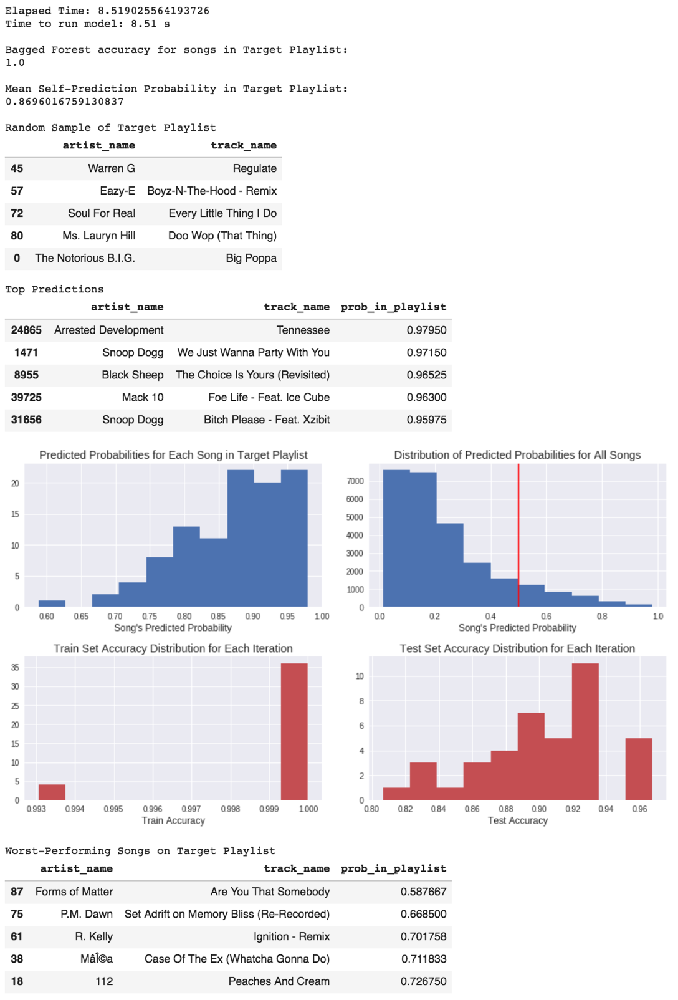

Obtaining Data and EDA

# Content-Based Recommendation Model

## Reading in the Data

``` python
import numpy as np
import pandas as pd
import matplotlib.pyplot as plt

import json
import time

from sklearn.model_selection import train_test_split
from sklearn.decomposition import PCA
from sklearn.preprocessing import StandardScaler
from sklearn.preprocessing import LabelEncoder
from sklearn.preprocessing import OneHotEncoder
from sklearn.linear_model import LogisticRegressionCV
from sklearn.ensemble import RandomForestClassifier

np.random.seed(21)
```
``` python
data = pd.read_csv("single_slice_k_means.csv", index_col=0)
```
```python
cols = list(data.columns[8:])
cols.append('duration_ms')

# get rid of NaNs unless they make up more than 5% of the data
na_idxs = data[data[cols].isna().any(axis=1)].index
assert len(na_idxs) < 0.05*len(data)
data = data.drop(na_idxs).reset_index(drop=True)

df = data[cols]

# change release date to decade
df['release_decade'] = df['release_dates'] // 10 # turn years into decades
df = df.drop('release_dates', axis=1)

display(df.head())
print()
display(df.columns)
```

```
Index(['track_uri', 'playlist_id', 'acousticness', 'danceability', 'energy',
       'instrumentalness', 'key', 'liveness', 'loudness', 'mode',
       'speechiness', 'tempo', 'time_signature', 'valence', 'explicit',
       '4_means_cluster', 'duration_ms', 'release_decade'],
      dtype='object')
```
The above output shows the head of the DataFrame with data for each song as obtained from Spotify's API. 
There is also a list of columns for the reader to understand the various predictors used.

The below cell contains a separation of the predictors into numerical and categorical predictors, with columns 
such as `track_uri` and `playlist_id` which will not directly be used in the training of the model in the 
`X_labels_other` group.

``` python
X_labels_num = ['acousticness', 'danceability', 'energy', 'instrumentalness',
                'liveness', 'loudness', 'speechiness', 'tempo', 'valence',
                'duration_ms']
X_labels_cat = ['key', 'mode', 'time_signature', 'release_decade', 'explicit', '4_means_cluster']
X_labels_other = df.columns.drop(X_labels_num).drop(X_labels_cat)
```

The next step is to transform the data. Standardization is perfomred on the numerical predictors in order 
to prepare them for Principal Component Analysis. Additionally, the categorical predictors are one-hot-encoded.

``` python
def transform_data(X, num_labels=X_labels_num, cat_labels=X_labels_cat):
  """
  Function to transform the data i.e. one-hot encode the categorical variables 
    and standardize (𝜇=0, 𝜎=1) the numerical variables.
  """
  scaler = StandardScaler()
  ohe = OneHotEncoder()
  X_num = pd.DataFrame(scaler.fit_transform(X[num_labels]), columns=num_labels).reset_index(drop=True)
  X_cat = pd.get_dummies(X[cat_labels].astype(object)).reset_index(drop=True)
  X_out = X_cat
  X_out[num_labels] = X_num
  X_out[X_labels_other] = X[X_labels_other].reset_index(drop=True)
  return X_out

df_scaled = transform_data(df)
```

## Helper Functions

``` python
def separate_target_playlist(playlist_id, n_pca_comps = None):
  """
  Separates the overall `df_scaled` into a target playlist (`playlist1`) and
    the rest of the unique songs in the dataset of playlists (`rest`).
  """
  if n_pca_comps is None:
    this_df = df_scaled.copy()
  else:
    pca = PCA(n_pca_comps)
    df_pca = pd.DataFrame(pca.fit_transform(df_scaled[list(labels)]))    
    df_pca[["track_uri", "playlist_id"]] = df_scaled[["track_uri", "playlist_id"]]
    this_df = df_pca
    
  playlist1 = this_df[this_df['playlist_id'] == playlist_id].reset_index(drop=True)
  rest = this_df[this_df['playlist_id'] != playlist_id].drop_duplicates("track_uri")
  return playlist1, rest

def get_X_train_test(test_size=0.3, random_state=None):
  """
  Gets the train and test data subsets.
  """
  X_train_1, X_test_1 = train_test_split(playlist1, test_size=test_size, random_state=random_state)
  X_train = X_train_1.append(rest.sample(n=len(X_train_1), random_state=random_state))
  X_test = X_test_1.append(rest.sample(n=len(X_test_1), random_state=random_state))
  y_train = (X_train['playlist_id'] == playlist_id).astype(int)
  y_test = (X_test['playlist_id'] == playlist_id).astype(int)
  X_train.drop(['playlist_id'], axis=1, inplace=True)
  X_test.drop(['playlist_id'], axis=1, inplace=True)
  
  return X_train, X_test, y_train, y_test
```

We know which songs the user already wants in the playlist. However, we don't know what songs they 
would not want to put in the playlist. So, we decided to randomly sample the `rest` dataset for a 
sample of equal size to the target playlist and assume that the user rejected those songs from the 
playlist. Because there are many songs in this dataset, this should be a reasonable assumption.


The above figure illustrates how the training set and test sets are chosen. The striped blocks represent 
test set selections (in reality, the test set is randomly sampled from Playlist 1) and the solid blocks 
are the training set. Green means the user wants that song in the playlist, while red is our assumption 
that the person would not want that song in the playlist.

``` python
def get_probs(data, n_estimators=100, max_depth=10, append_accs=False):
  """
  data = which playlist dataset you want to predict (`rest` or `playlist1`)
  
  Returns the predicted probabilities for songs in data
  """
  model = RandomForestClassifier(n_estimators=n_estimators, max_depth=max_depth)
  model.fit(X_train[list(labels)], y_train)
  if append_accs:
    train_accs.append(model.score(X_train[list(labels)], y_train))
    test_accs.append(model.score(X_test[list(labels)], y_test))
  return model.predict_proba(data[list(labels)])[:,1]
```

The `get_probs` function takes in a playlist dataset with all relevant predictors and returns an array of the 
predicted probabilities that each song is in the playlist. First, a Random Forest Classifier is trained on the 
training set. Next, the train and test accuracies are added to lists. The function returns a list of the 
probabilities that each song in the passed in `data` is assigned by the model as being classified into the 
playlist. We are operating under the assumption that the predicted probabilities are analogous to the probability 
that a user would add the song to the playlist.

Using the above methodology could be prone to some missteps, however. There is a nonzero chance that the randomized 
selection of songs that are classified as 0's could include a song that the user would actually want in the playlist:


The red point in the cluster of green could occur. Additionally, this method of randomly sampling the rejected songs 
could lead to the model being overfit to the one randomly selected sample of songs as the rejected playlist. In order 
to combat this, we propose a model we are calling the *Bagged Forest*. 

## Bagged Forest

The bagging in "Bagged Forest" comes from the ensemble method of Bootstrap AGGregatING. Instead of bootstrapping a 
subset of the training set to train many weak learners, we are bootstrapping the rejected songs from the playlist in 
order to reduce the bias while also reducing variance due to the Central Limit Theorem. Bootstrapping provides a 
different rejected set for each training dataset. Then, the resulting probabilities from each iteration of the bootstrap 
are averaged in order to obtain final probability predictions for the Bagged Forest model:


``` python
def bootstrap_0s(this_playlist_id, include_k_means=False, n_iter=1000, 
                 random=True, n_estimators=50, n_pca_comps = None, 
                 max_depth=15, print_progress=False):
  """
  this_playlist_id = desired playlist_id to match
  include_k_means = boolean of whether to include the $k$-means predictor
  n_iter = number of iterations of the bootstrapped selection of songs
    to not include in the playlist; default 1000
  random = whether or not the bootstrap should be random
  n_estimators = number of estimators in Random Forest
  n_pca_comps = number of PCA components desired. Value of None means no PCA
    will be performed
  max_depth = max depth of trees in Random Forest
  print_progress = boolean of whether to print when each iteration is done
    being fitted (to track progres)

  Function returns mean probability for each song in `rest`, `playlist1` over 
    bootstrap (2 return items) and times the duration.
  """
  start = time.time()
  
  # global test and train accuracy storage from each Random Forest model
  global train_accs, test_accs
  train_accs = []
  test_accs = []
  
  # save playlist_id as global variable
  global playlist_id, labels
  playlist_id = this_playlist_id
  labels = df_scaled.columns.drop(["track_uri", "playlist_id"])
  
  # if not including k_means, drop columns associated with k-means clusters
  if not include_k_means:
    for col in df_scaled.columns:
      if "means_cluster" in col:
        labels = labels.drop([col])
  
  # get target playlist and rest
  global playlist1, rest
  playlist1, rest = separate_target_playlist(playlist_id, n_pca_comps = n_pca_comps)
  
  # update labels for if PCA has been run
  if n_pca_comps is not None:
    labels = playlist1.columns.drop(["track_uri", "playlist_id"])
  
  # get labels (have to run get_X_train_test once)
  global X_train, X_test, y_train, y_test
  X_train, X_test, y_train, y_test = get_X_train_test(random_state=0)
  
  # set random state to None if user wants randomness
  if random:
      random_state=None
      
  # create list to store probability predictions
  playlist1_prob_preds = []
  rest_prob_preds = []
  
  # begin iterations
  for i in range(n_iter):
    if print_progress:
      j = 0
      if i % (n_iter // 20) is 0:
        print(j, ' ', sep='')
        j += 5
    if not random:
      random_state=i
    X_train, X_test, y_train, y_test = get_X_train_test(random_state=random_state)
    rest_prob_preds.append(get_probs(rest, n_estimators=n_estimators, max_depth=max_depth, append_accs=True))
    playlist1_prob_preds.append(get_probs(playlist1, n_estimators=n_estimators, max_depth=max_depth))
    
  # aggregate probability predicts with mean
  rest_prob_preds = np.array(rest_prob_preds)
  playlist1_prob_preds = np.array(playlist1_prob_preds)
  
  end = time.time()
  print("Elapsed Time:", end - start)
  
  return np.mean(rest_prob_preds, axis=0), np.mean(playlist1_prob_preds, axis=0), end - start
```

``` python
def get_results(n_predictions=10, diagnostics = False, 
                include_playlist_sample = False):
  """
  Diagnostics include plots of accuracies and predictions, mean prediction
    probability in the target playlist, and worst-performing songs in the 
    training playlist, and time
  
  diagnostics = False returns only the top n_predictions and the accuracy of the 
    on the Bagged Forest on the target playlist
  include_playlist_sample = True returns a randomly selected sample of the songs
    in the target playlist
  """
  if diagnostics:
    print("Time to run model:", duration * 100 // 1 / 100, "s")
    print()
  
  acc = np.mean(playlist1_prob_preds >= 0.5)
  print("Bagged Forest accuracy for songs in Target Playlist:")
  print(acc)
  print()
  
  if diagnostics:
    print("Mean Self-Prediction Probability in Target Playlist:")
    print(np.mean(playlist1_prob_preds))
    print()
  
  if include_playlist_sample:
    sample = playlist1.sample(5)
    track_uris_sample = sample["track_uri"]
    sample = data[data["playlist_id"] == playlist_id][data["track_uri"].isin(track_uris_sample)][['artist_name','track_name']]
    display(sample)
    print()
  
  rest['prob_in_playlist'] = rest_prob_preds
  results = rest.sort_values('prob_in_playlist', ascending=False)
  track_uris = list(playlist1['track_uri'])

  # get rest tracks that are not in playlist1
  exclusive_results = results[~results['track_uri'].isin(track_uris)]
  clean_results = data.loc[list(exclusive_results.index)][['artist_name','track_name']]
  clean_results['prob_in_playlist'] = exclusive_results['prob_in_playlist']
  print("Top Predictions")
  display(clean_results.head(n_predictions))
  print()
  
  if diagnostics:
    # get plots
    fig, axs = plt.subplots(2,2,figsize=(12,7))

    axs.flat[0].hist(playlist1_prob_preds, color="C0")
    axs.flat[0].set_title('Predicted Probabilities for Each Song in Target Playlist', size=14)
    axs.flat[0].set_xlabel("Song's Predicted Probability", size=12)

    axs.flat[1].hist(rest_prob_preds, color="C0")
    axs.flat[1].set_title('Distribution of Predicted Probabilities for All Songs', size=14)
    axs.flat[1].set_xlabel("Song's Predicted Probability", size=12)
    axs.flat[1].axvline(0.5, color="red")

    axs.flat[2].hist(train_accs, color="C2")
    axs.flat[2].set_title("Train Set Accuracy Distribution for Each Iteration", size=14)
    axs.flat[2].set_xlabel("Train Accuracy", size=12)

    axs.flat[3].hist(test_accs, color="C2")
    axs.flat[3].set_title("Test Set Accuracy Distribution for Each Iteration", size=14)
    axs.flat[3].set_xlabel("Test Accuracy", size=12)

    plt.tight_layout()
    plt.show()

    # get worst playlist1 tracks
    playlist1['prob_in_playlist'] = playlist1_prob_preds
    results = playlist1.sort_values('prob_in_playlist', ascending=True)
    track_uris_results = results["track_uri"]
    self_results = data[data["playlist_id"] == playlist_id][data["track_uri"].isin(track_uris_results)][['artist_name','track_name']]
    self_results['prob_in_playlist'] = np.array(results['prob_in_playlist'])
    print()
    print("Worst-Performing Songs on Target Playlist")
    display(self_results.head(n_predictions))
```

``` python
# rest_prob_preds, playlist1_prob_preds = bootstrap_0s(49001, n_pca_comps=5, include_k_means=False, n_iter=40)
rest_prob_preds, playlist1_prob_preds, duration = bootstrap_0s(49000, include_k_means=False, n_iter=40)
```
```
Elapsed Time: 8.795955657958984
```

``` python
get_results(5, diagnostics=True, include_playlist_sample=True)
```


The above results show the output from the model on the first playlist in the dataset with `playlist_id` 49000 with 40 
iterations in the Bagged Forest. By observation, the playlist appears to be focused on rap and maybe R&B music. Judging 
from the top predictions, they are mostly rap songs from the 1990s or 2000s, so the model appears to be doing well on a 
qualitative assessment.

Using quantitative measures, the model appears to correctly classify all of the songs that are actually in the playlist. 
However, it performs relatively poorly on the predicted probabilities on several songs, as shown in the last DataFrame 
above, with probabilities hovering between 65 and 75%. This is high enough to be classified as in the playlist, but the 
predicted probability is more interesting here.

From the plots, the top two plots in blue show the distribution of predicted probabilities for all songs in the target 
playlist (left) and predicted probabilities for all songs in the dataset (right). The predicted probabilities in the 
target playlist on the left are skewed to the left, which is a good sign because the majority of the predicted probabilities 
are very high. In contrast, we would expect the predicted probabilities for all songs in the dataset on the right to be 
right-skewed because most of the songs in the dataset probably are not similar to the playlist, with a few being more 
similar and being potential songs that the user would like to add to the playlist.

The bottom two plots in red show the distribution of the train and test set accuracy for each iteration of the bootstrap. 
The training set consistently obtains 100% accuracy with a few outliers, which is good because it implies the model is 
learning the difference between what is in and what is not in the playlist. The plot on the right shows the same 
information for test set accuracy. These are less than 1 and have more variability than the training accuracies, but 
they are still very high. These two plots can also be thought as a reasonable proxy for understanding the quality of 
the Bagged Forest approach. It looks like some of the bootstrapped training sets contain overlap in what is assigned 
to $y=0$ and $y=1$, suggesting that the bagging approach is justified in order to be able to conduct a supervised 
learning approach with less separable data.

The three metrics at the top of the ouput are time, accuracy for songs in the target playlist, and mean self-prediction 
probability. The time is pretty long, and that is one of the tradeoffs of having the more robust Bagged Forest approach. 
The accuracy for target playlist songs serves as a sanity check to make sure that the model predicts that the user will 
choose the songs that are already in the playlist to be added into the playlist. The mean self-prediction probability is 
a finer measure of that same idea. A larger mean self-prediction probability means that the model is, on average, more 
confident that all of the songs in the target playlist belong there.

## Tuning the Trees

In the cell below, we perform a CV-like procedure to find the best value for max_depth. We test values from 1 to 20, and for each value, we create 300 different models based on 300 randomly sampled playlists. Then, we record the train and test accuracies of each model at each depth in two dictionaries we define below, each indexed by depth. Once this is complete, we compute the mean test accuracy (across the 300 different models) of each value of max_depth, and select the value with the highest average testing accuracy.

``` python
depths = range(1,21)
depth_train_scores = {depth: [] for depth in depths}
depth_test_scores = {depth: [] for depth in depths}

playlists = np.random.choice(range(49000, 49999), size=300, replace=False)
for i, playlist in enumerate(playlists):
    X_train, X_test, y_train, y_test = get_train(playlist)
    for depth in depths:
        model = RandomForestClassifier(n_estimators=100, max_depth=depth)
        model.fit(X_train[labels], y_train)
        depth_train_scores[depth].append(model.score(X_train[labels], y_train))
        depth_test_scores[depth].append(model.score(X_test[labels], y_test))        
```

``` python
test_score_means = [np.mean(depth_test_scores[i]) for i in range(1, 21)]
train_score_means = [np.mean(depth_train_scores[i]) for i in range(1, 21)]

best_test_depth = np.argmax(test_score_means) + 1
best_train_depth = np.argmax(train_score_means) + 1

plt.plot(range(1, 21), test_score_means)
plt.plot(best_test_depth, max(test_score_means), color='red', marker='o')
plt.plot(range(1, 21), train_score_means)
plt.plot(best_train_depth, max(train_score_means), color='black', marker='o')
plt.xlabel("Max Depth")
plt.ylabel("Mean Accuracy")
plt.title("Mean Test and Train Accuracies at Different Values of max_depth")
plt.legend(labels=['Testing', 'Training'])
plt.show()
```


## Model Comparison
Logistic Regression (Baseline) vs Random Forest vs Bagged Forest

``` python
# Logistic Regression
log_model = LogisticRegressionCV()
log_model.fit(X_train[list(labels)], y_train)
log_train_score = log_model.score(X_train[list(labels)], y_train)
log_test_score = log_model.score(X_test[list(labels)], y_test)

# Single Random Forest
#   equivalent to bagged forest with 1 iteration
rest_prob_preds_rf, playlist1_prob_preds_rf, duration_rf = bootstrap_0s(49000, include_k_means=False, n_iter=1)
rf_train_score = np.mean(train_accs)
rf_test_score = np.mean(test_accs)

# Bagged Forest
#   40 iterations
rest_prob_preds_bf, playlist1_prob_preds_bf, duration_bf = bootstrap_0s(49000, include_k_means=False, n_iter=40)
bf_train_score = np.mean(train_accs)
bf_test_score = np.mean(test_accs)
```
``` python
xs = ["Logistic Regression", "Random Forest", "Bagged Forest"]
plt.bar(xs,[log_train_score, rf_train_score, bf_train_score])
plt.bar(xs,[log_test_score, rf_test_score, bf_test_score])
plt.legend(["Train", "Test"], loc=2)

y_min = min(log_train_score, rf_train_score, bf_train_score, 
            log_test_score, rf_test_score, bf_test_score)
plt.ylim(y_min - 0.05,1.04)
plt.title("Train and Test Scores of Models", size=14)

plt.show()
```


Comparing the various models, logistic regression clearly underperforms when compared to the nonparametric Random 
Forest approaches. Tt would appear that the single random forest is actually performing better than the bagged 
forest approach because the test accuracy is higher. However, it is important to keep in mind the interpretation 
of the test accuracy. The test accuracy judges how well the model performs on the test set, which includes the 
random sample of songs that we assumed the user would not like. Thus, test accuracy is not directly an indicator for 
how well the model performs at choosing songs the playlist creator would want to add. Instead, it judges how accurately 
the model classifies songs as being both included *and excluded* from the playlist. However, we don't know whether 
the user would actually want to exclude the songs that were randomly chosen from the playlist. Thus, this is not 
necessarily conclusive proof that the single Random Forest approach is superior *in the context of this problem*.

``` python
print("Average Self-Predicted Probabilities")
print("\tRandom Forest:", np.mean(playlist1_prob_preds_rf) * 100000 // 1 / 100000)
print("\tBagged Forest:", np.mean(playlist1_prob_preds_bf) * 100000 // 1 / 100000)
```
```
Average Self-Predicted Probabilities
	Random Forest: 0.85731
	Bagged Forest: 0.86669
```

The average self-predicted probabilities above are the average of the probabilities the model predicts for each 
song in the target playlist. With a perfect model, this would be 1.0 as it would recognize that every song in the 
model belongs in the playlist. Sometimes Random Forest performs better, other times the Bagged Forest is superior.

``` python
fig, axs = plt.subplots(3,2, figsize=(10,8))
bins = np.arange(0,1.05,0.05)
axs[0][0].hist(playlist1_prob_preds_bf, label="bf", color="C2",
         bins=bins, alpha=1)
axs[0][1].hist(playlist1_prob_preds_rf, label="rf", color="C0",
         bins=bins, alpha=1)

axs[0][0].set_title("Target Playlist Probabilities: Bagged Forest - 40 Iterations")
axs[0][1].set_title("Target Playlist Probabilities: Single Random Forest")

ylim_0 = max(axs[0][0].get_ylim()[1], axs[0][1].get_ylim()[1])
axs[0][0].set_ylim((0,ylim_0))
axs[0][1].set_ylim((0,ylim_0))

axs[1][0].hist(rest_prob_preds_bf, label="bf", color="C2",
         bins=bins, alpha=1)
axs[1][1].hist(rest_prob_preds_rf, label="rf", color="C0",
         bins=bins, alpha=1)

axs[1][0].set_title("All Songs Probabilities: Bagged Forest - 40 Iterations")
axs[1][1].set_title("All Songs Probabilities: Single Random Forest")

ylim_1 = max(axs[1][0].get_ylim()[1], axs[1][1].get_ylim()[1])
axs[1][0].set_ylim((0,ylim_1))
axs[1][1].set_ylim((0,ylim_1))

bins2 = bins = np.arange(0.8,1.01,0.025)

axs[2][0].hist(rest_prob_preds_bf[rest_prob_preds_bf > 0.8], label="bf", color="C2",
         bins=bins, alpha=1)
axs[2][1].hist(rest_prob_preds_rf[rest_prob_preds_rf > 0.8], label="rf", color="C0",
         bins=bins, alpha=1)

axs[2][0].set_title("All Songs > 0.8: Bagged Forest - 40 Iterations")
axs[2][1].set_title("All Songs > 0.8: Single Random Forest")

ylim_2 = max(axs[2][0].get_ylim()[1], axs[2][1].get_ylim()[1])
axs[2][0].set_ylim((0,ylim_2))
axs[2][1].set_ylim((0,ylim_2))

plt.tight_layout()
plt.show()
```


Comparing the random and bagged forest models, it again looks like random forest performs better. In the first row of 
plots above with target playlist probabilities (which shows the distribution of the model's predicted probabilities for 
the target playlist), the random forest has more probabilities near 1.0. This means that the random forest is more 
confident than the bagged forest about a larger proportion of the songs in the target playlist, which on the surface 
appears to be a good sign. However, this is likely an example of a type of 
[Dunning-Kruger](https://en.wikipedia.org/wiki/Dunning%E2%80%93Kruger_effect) effect in our models.

The random forest is "dumber" than the bagged forest because it trains on only one specific possible subset of all songs 
as the rejected $y=0$ tracks. Because the random forest is trained on less information, it is able to be more confident 
in its recommendations because the songs that it is predicting with very high probabilities are the ones that are not 
just most similar to the songs in the target playlist, but they are also most different from the randomly chosen rejected 
tracks. The bagging approach minimizes the latter effect, focusing primarily on songs that are most similar to the target. 
This is because bootstrapping the rejected songs makes it so that each iteration's top predicted songs are dissimilar to 
different subsets of rejected tracks. The constant factor across all of the iterations is the similarity of the top songs 
to the target. Thus, if a song is ranked highly consistently across all iterations of the bagged forest, then it is likely 
a good match to the target playlist.

This effect helps explain the above plots. The third row of plots above shows the distribution of probabilities of all 
predicted songs with more than 80% probability. The bagged forest has fewer high-ranked songs than the random forest. 
However, these high-ranked songs are likely to be of a higher quality in terms of whether the user would like them 
compared to the single random forest.

## PCA Investigation
Does adding PCA reduce the amount of time it takes to train and fit the bagged forest?

``` python
pca = PCA(len(labels))
pca.fit(X_train[list(labels)])
plt.plot(range(1,len(labels)+1), np.cumsum(pca.explained_variance_ratio_))
plt.xlabel("Number of Principal Components", size=13)
plt.ylabel("% Variance Explained", size=13)
plt.title("Variance Explained by Principal Components")

plt.show()
```


The plot above shows that about 12-13 principal components are needed to be able to explain 90% of the 
variance in the predictors, which is only approximately 30% of all of the predictors. Due to the iterative 
nature of the bootstrapping process, this could result in improvements in the time it takes to run the model.

``` python
rest_probs = []
playlist1_probs = []
durations = []
pca_comps = [2, 5, 10, 13, 25, None]
for i in pca_comps:
  rest_prob_preds_temp, playlist1_prob_preds_temp, duration_temp = bootstrap_0s(49000, n_pca_comps=i, n_iter=40)
  rest_probs.append(rest_prob_preds_temp)
  playlist1_probs.append(playlist1_prob_preds_temp)
  durations.append(duration_temp)
```

``` python
# change None in `pca_comps` to total number of predictors for plotting
pca_comps_plot = pca_comps[:-1]
pca_comps_plot.append(len(labels))
plt.plot(pca_comps_plot, durations)

plt.title("Number of PCA Components over Time: 40-Iteration Bagged Forest", size=14)
plt.xlabel("Number of PCA Components")
plt.ylabel("Time")

plt.show()
```


Principal Component Analysis does not appear to have much of a traceable effect on the amount of time it takes to 
run the model. This could be because the PCA `fit_transform` process probably adds back any time saved in fitting 
each Random Forest models faster. Instead, the number of iterations could be used in a tradeoff between the duration 
and overfitting to the randomly selected subsample(s) of rejected songs.

## K-Means Investigation
(Part of our material outside the scope of the class for 209a credit)

We wanted to see if a [k-means](https://www-cs.stanford.edu/~acoates/papers/coatesng_nntot2012.pdf) 
algorithm could be used for 
[feature engineering](https://towardsdatascience.com/how-to-create-new-features-using-clustering-4ae772387290) 
to provide us with more features to improve the model. 

``` python
from sklearn.cluster import KMeans
from sklearn.metrics import silhouette_score
```

``` python
# drop columns we don't need
#   `df_scaled` already contains cluster information so I should remove that
X = df_scaled.drop(['track_uri', 'playlist_id', '4_means_cluster_0', 
                    '4_means_cluster_1', '4_means_cluster_2', 
                    '4_means_cluster_3'], axis=1)
```

``` python
ks = [2,4,7,10,15,20,25,30,35,40,45,50,55,60,65,70,75,80,85,90,95,100]
silhouette_scores = []
for k in ks:
  model = KMeans(n_clusters=k, random_state=21)
  k_means_labels = model.fit_predict(X)
  X["labels"] = k_means_labels
  X_sub = X.sample(frac=0.1)
  silhouette_scores.append(silhouette_score(X_sub.drop('labels', axis=1), X_sub['labels']))
```

``` python
plt.plot(ks, silhouette_scores)
plt.xlabel("Number of Clusters, $k$")
plt.ylabel("Silhouette Score")
plt.title("Silhouette Score by Number of Clusters")
plt.show()
```


The silhouette score is a measure of how well observations fit into their respective clusters as determined by the 
algorithm, with a larger silhouette score being better. The silhouette scores in the plot above are not great, 
indicating that the data is not well-separable into clusters. This is probably because each song falls along a 
spectrum of the different predictors we have. It might have been easier if we had genre predictor variables to 
separate the data, but that was unavailable. 

As the number of clusters increases, the silhouette score tends to decrease. Typically, one looks for the peak of the 
silhouette score. In this case, that would mean using 2 clusters, but that doesn't convey a lot of information. 
Instead, we chose to use $k=4$ clusters.

``` python
# drop previously added labels column from X
if "labels" in X.columns:
  X.drop("labels", inplace=True, axis=1)

# fit KMeans model
model = KMeans(n_clusters=4)
k_means_labels = model.fit_predict(X)

# add Cluster as feature
data["4_means_cluster"] = k_means_labels

# Visualize on 2 PCA Comps
pca = PCA(2)
X_pca = pca.fit_transform(X)

fig, axs = plt.subplots(2,2,figsize=(7,7), sharex=True, sharey=True)
for label, ax in zip(pd.Series(k_means_labels).sort_values().unique(), axs.flat):
  ax.scatter(X_pca[:,0], X_pca[:,1], label = "All", color="C4")
  ax.scatter(X_pca[:,0][data["4_means_cluster"] == label], X_pca[:,1][data["4_means_cluster"] == label], 
              label = "Cluster " + str(label), color = "C" + str(label))
  ax.legend()
  
plt.tight_layout()
fig.text(0.5, -0.01, '1st Principal Component', ha='center')
fig.text(-0.01, 0.5, '2nd Principal Component', va='center', rotation='vertical')
fig.text(0.21, 1.01, "Visualizing $k$-Means on First 2 Principal Components", va='center', size=14)
plt.show()
```


Visualizing the k-means algorithm on the first two principal components, which explain approximately one third of the 
variance, it is clear that the k-means algorithm is separating the songs by some kinds of cluster. There is a fair 
amount of overlap because we are only visualizing principal components that only explain one third of the variance in 
the predictors, yet the k-means algorithm was run across all dimensions of predictor variables.

The next step is to determine whether adding these clusters as features produces any improvement in the model.

``` python
# With clusters as features
rest_prob_preds_w, playlist1_prob_preds_w, duration_w = bootstrap_0s(49000, include_k_means=True, n_iter=40)
w_train_score = np.mean(train_accs)
w_test_score = np.mean(test_accs)

# Without clusters as features
rest_prob_preds_wo, playlist1_prob_preds_wo, duration_wo = bootstrap_0s(49000, include_k_means=False, n_iter=40)
wo_train_score = np.mean(train_accs)
wo_test_score = np.mean(test_accs)
```

``` python
xs = ["With", "Without"]
plt.bar(xs,[w_train_score, wo_train_score])
plt.bar(xs,[w_test_score, wo_test_score])
plt.legend(["Train", "Test"], loc=2)

y_min = min(w_train_score, wo_train_score, w_test_score, 
            wo_test_score)
plt.ylim(y_min - 0.05,1.04)
plt.title("Train and Test Scores of Bagged Forests With and Without Clusters", 
          size=14)

plt.show()
```


``` python
print("Average Self-Predicted Probabilities")
print("\tWith Clusters:", np.mean(playlist1_prob_preds_w) * 100000 // 1 / 100000)
print("\tWithout Clusters:", np.mean(playlist1_prob_preds_wo) * 100000 // 1 / 100000)
```
```
Average Self-Predicted Probabilities
	With Clusters: 0.86842
	Without Clusters: 0.86905
```

``` python
fig, axs = plt.subplots(3,2, figsize=(10,8))
bins = np.arange(0,1.05,0.05)
axs[0][0].hist(playlist1_prob_preds_w, label="With", color="C1",
         bins=bins, alpha=1)
axs[0][1].hist(playlist1_prob_preds_wo, label="Without", color="C3",
         bins=bins, alpha=1)

axs[0][0].set_title("Target Playlist Probabilities: With Clusters")
axs[0][1].set_title("Target Playlist Probabilities: Without Clusters")

ylim_0 = max(axs[0][0].get_ylim()[1], axs[0][1].get_ylim()[1])
axs[0][0].set_ylim((0,ylim_0))
axs[0][1].set_ylim((0,ylim_0))

axs[1][0].hist(rest_prob_preds_w, label="With", color="C1",
         bins=bins, alpha=1)
axs[1][1].hist(rest_prob_preds_wo, label="Without", color="C3",
         bins=bins, alpha=1)

axs[1][0].set_title("All Songs Probabilities: With Clusters")
axs[1][1].set_title("All Songs Probabilities: Without Clusters")

ylim_1 = max(axs[1][0].get_ylim()[1], axs[1][1].get_ylim()[1])
axs[1][0].set_ylim((0,ylim_1))
axs[1][1].set_ylim((0,ylim_1))

bins2 = bins = np.arange(0.8,1.01,0.025)

axs[2][0].hist(rest_prob_preds_w[rest_prob_preds_w > 0.8], label="With", color="C1",
         bins=bins, alpha=1)
axs[2][1].hist(rest_prob_preds_wo[rest_prob_preds_wo > 0.8], label="Without", color="C3",
         bins=bins, alpha=1)

axs[2][0].set_title("All Songs > 0.8: With Clusters")
axs[2][1].set_title("All Songs > 0.8: Without Clusters")

ylim_2 = max(axs[2][0].get_ylim()[1], axs[2][1].get_ylim()[1])
axs[2][0].set_ylim((0,ylim_2))
axs[2][1].set_ylim((0,ylim_2))

plt.tight_layout()
plt.show()
```


Predicting with and without clusters have similar overall distributions of predicted probabilities. Looking at the 
bottom set of plots for songs with predicted probabilities greater than 0.8, it looks like the clusters predict 
more songs with greater probabilities than the model without clusters - the area under the curve is larger. There 
are two possible explanations for this: either the addition of the clusters makes the model more confident about the 
songs that most closely match, or the clusters confuse the model and prevent it from ranking other songs as highly as 
it would have because of its cluster. Since the clusters had relatively low silhouette scores, this second hypothesis 
is probably more likely as the clusters are not great representations of the data as a whole.

