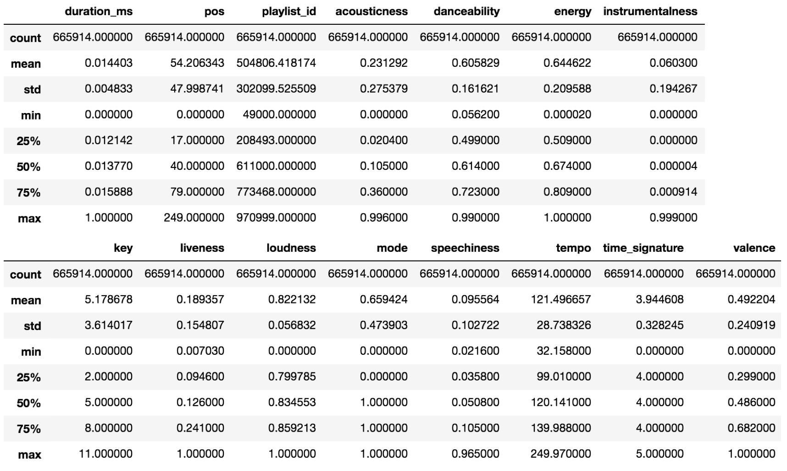
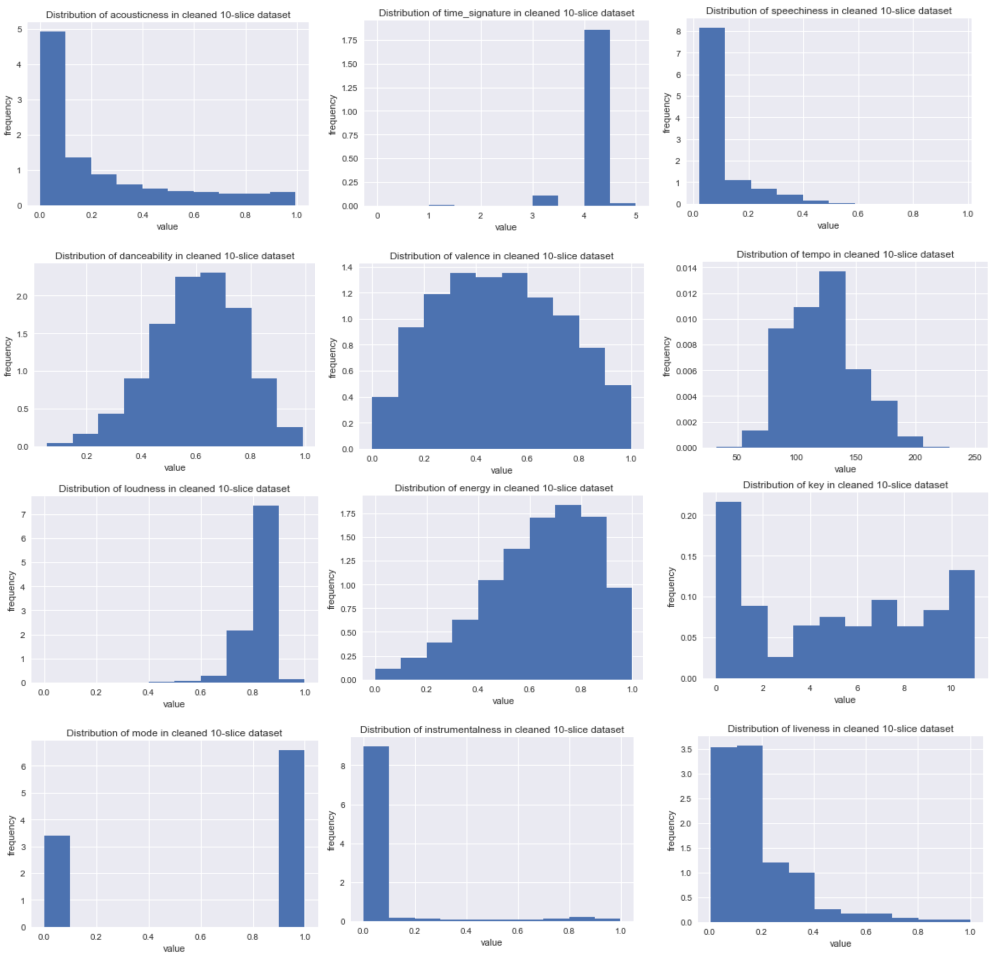
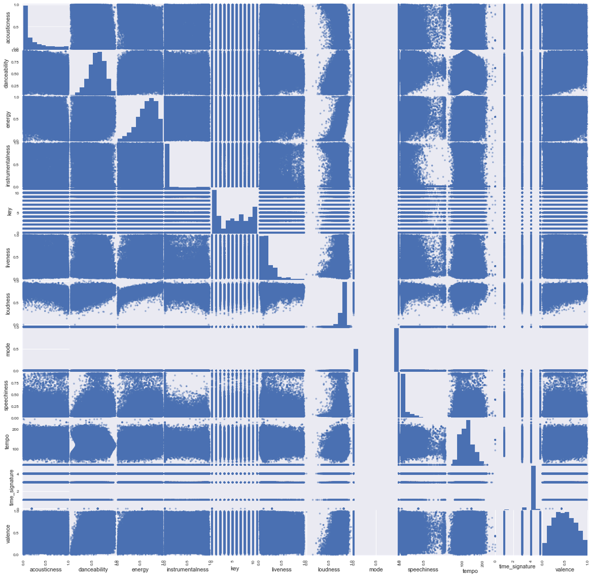

# Obtaining Data and EDA

## Content-Based Recommendation

### Data Sources

We began by extracting ten random slices from the 
<a href="https://labs.spotify.com/2018/05/30/introducing-the-million-playlist-dataset-and-recsys
-challenge-2018/">“Million Playlist” dataset</a>, with each slice containing 1000 playlists. 
In total, each slice of our dataset contains roughly 60 to 70 thousand songs. Then, for each track, 
we make calls to the Spotify API (using the library Spotipy, documentation found in appendix below) to 
obtain the following audio features: 

- `duration_ms` – duration of the song in milliseconds.
- `acousticness` – probability measure of whether the track is acoustic.
- `danceability` – metric between 0 and 1 describing how suitable track is for dancing.
- `energy` – measure from 0 to 1 describing perceived intensity and activity.
- `instrumentalness` – probability measure indicating whether the track contains no vocals.
- `key` – categorical from 0 to 11, represents the key the track is in.
- `liveness` – probability measure indicating whether the track is from a live performance.
- `loudness` – a decibel measure of how loud the track is overall.
- `mode` – binary measure indicating modality of a track, 0 for minor and 1 for major.
- `speechiness` – measure from 0 to 1 detecting the amount of spoken word audio in a track. 
- `tempo` – overall estimated tempo of the track in BPM (beats per minute).
- `time_signature` – categorical, 0 to 5, overall estimated time signature (meter) of the track.
- `valence` – measure from 0 to 1 describing the positiveness (happy vs. sad/angry) of a track.

``` python
# random number generator to choose which of the json files to load as data
np.random.randint(1,1000,10)
```
``` 
array([970, 208, 825, 773,  49, 369, 121, 420, 701, 611])
```

The data in its raw form is a JSON, so we had to convert this to a CSV for ease of use:

``` python
def get_json(file_range=10):
  # Looks for files of the name 'slice_i.json' with i being the number
  # default is 10 json files
  # returns a list of the jsons
  data = []
  for i in range(file_range):
    filename = 'slice_' + str(i) + '.json'
    try:
      with open(filename) as f:
        data.append(json.load(f))
    except FileNotFoundError:
      print('Error, file not found')
      return []
  return data
```

# TODO TODO TODO 
# TODO TODO TODO 
# TODO TODO TODO 
# TODO TODO TODO 

Using the Pandas `describe` function, before making any changes to the data, we obtain the following table showing 
certain summary statistics for each of the above features. From the descriptions above and the tables below, we notice
a few noteworthy things about our data: all of our features are already quantitative variables (aided by Spotify’s 
casting of some features such as key and mode to numerical labels). Most of our features are continuous, with the 
exception of `key`, `mode`, and `time_signature` which are categorical. Finally, we see that for the continuous audio 
features, all of them range from 0 to 1 with the exception of `duration_ms` and `loudness`. We discuss how we might deal 
with this in the section below.

``` python
data = pd.read_csv("10_slices_audio_features.csv", encoding='latin1')
data = data.drop("Unnamed: 0", axis=1)
data.describe()
```


### Data Cleaning

Out of the 666,092 observations in our 10-slice dataset, only 7 points contain missing data, where a certain audio feature 
for a particular track is not available from the Spotify API and is returned as `NaN`. We consider this to be a negligible 
amount of missing data given the large size of our dataset, so we feel comfortable simply dropping these points. 

``` python
data.dropna(inplace=True)
```

However, we must also search for disguised missing data, in this case where a potential `NaN` is disguised as a 0 and 
therefore does not get dealt with. We are tipped off to this by the fact that in Table 1 above, we see that the minimum
value for `duration_ms` is 0, which certainly seems odd. We might expect some of these features to have minimum values 
of 0 (for example if there is an extremely low probability that the track is acoustic, the `acousticness` feature may 
just be returned as 0), but we find it strange that a song would have absolutely no duration. We investigate further by 
looking at examples where `duration_ms` is 0, and we find that this is indeed a mistake. There are 6 tracks where 
`duration_ms` is marked as 0, and in each case the track is ‘real’, i.e. has non-zero duration. Once again, this is an 
extremely small number of points relative to the size of the overall dataset, so we feel comfortable dropping these points.

``` python
data = data.drop(data[data.duration_ms == 0].index)
```

Our experience with `duration_ms` inspires us to look for disguised missing data with the other features. In doing so, 
we find a number of strange-looking tracks where nearly every single feature is given a 0 value, and where these 0 
values make no sense. For example, one version of Taylor Swift’s “Shake it Off” is given a 0 `danceability` 
score (along with 0 values for nearly every other feature), which is likely a corrupted data point. Thus, for each 
predictor, we look at the points where the predictor is assigned a 0 value, and we find that the strange tracks for 
each predictor have a common thread: they all have mistaken 0 values for `tempo`, `speechiness`, and `danceability`. 
We find a total of 165 spurious observations such as this. Once again, this is a very small number compared to the 
size of the entire dataset, so we feel comfortable dropping these points, though we may investigate later if some 
form of imputation gives us better results with our model.

``` python
data = data.drop(data[data.danceability == 0].index)
```

Finally, the last bit of cleaning we perform is to normalize the features `duration_ms` and `loudness` to vary from 
0 to 1, in order to match our other continuous features which already run on this range, and so that they are not on 
wildly different scales.

``` python
# Normalize duration and loudness to vary from 0 to 1.
data['duration_ms'] = (data['duration_ms'] - min(data['duration_ms']))/(max(data['duration_ms']) - min(data['duration_ms']))
data['loudness'] = (data['loudness'] - min(data['loudness']))/(max(data['loudness']) - min(data['loudness']))
```
### Data Visualization

We include here histograms of our key audio features, showing their distributions in the 10-slice dataset. Looking at these 
feature distributions, we see that some predictors such as `danceability` and `tempo` look fairly normally distributed, 
although there is some definite left-skewness. The feature `energy` is highly left-skewed but retains a normal shape. 
The features `acoustiness` and `speechiness` are severely right-skewed and look almost exponentially distributed, and 
`valence` looks fairly symmetric but has very fat tails. Since many of our predictors seem to have very different 
distributions and very different skews, our best bet is indeed to try a model which makes no assumptions about the 
underlying distribution of the data: Random Forest.

``` python
# Visualize distributions
for predictor in data.columns[9:]:
    plt.hist(data[predictor], normed=True)
    plt.xlabel("value")
    plt.ylabel("frequency")
    plt.title("Distribution of " + predictor + " in cleaned 10-slice dataset")
    plt.show()
```


We also see in the scatter matrix below that we do not have to worry greatly about high correlation between these factors. 
We see that the feature `loudness` is negatively correlated with `acousticness` and positively correlated with `energy` 
(as we might expect), but beyond this the features seem to be scattered around fairly independently of one another. 
This is a good sign -- as it means we do not have to worry about transforming/dropping factors due to multicollinearity.

``` python
pd.plotting.scatter_matrix(data[data.columns[9:]], alpha=0.5, figsize=(20.0, 20.0))
plt.show()
```


## Cold-Start Problem Data
For the cold-start problem, the data set is a subset of <a href="https://labrosa.ee.columbia.edu/millionsong/tasteprofile">
The Echo Nest Taste Profile Subset</a>, having 2 million user records composed of triplet (`user_tag`, `song_tag`, 
`play_count`). 

